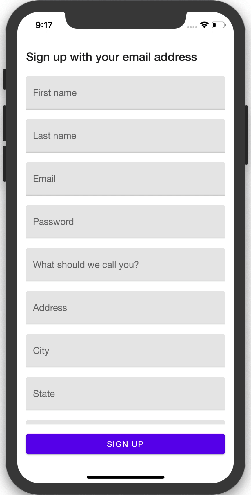

# react-native-keyboard-avoiding-scroll-view

[](https://www.npmjs.org/package/react-native-keyboard-avoiding-scroll-view)
[](https://circleci.com/gh/alkafinance/workflows/react-native-keyboard-avoiding-scroll-view/tree/master)


[](https://github.com/prettier/prettier)
[](https://github.com/semantic-release/semantic-release)

React Native ScrollView extension that prevents inputs from being covered by the keyboard.



## Getting started

`$ npm install react-native-keyboard-avoiding-scroll-view --save`

## Usage

Import `KeyboardAvoidingScrollView`, `KeyboardAvoidingFlatList`, or `KeyboardAvoidingSectionList` and use them like the regular `ScrollView`, `FlatList` or `SectionList` components from React Native core. Internally, these components are wrapped in another custom component called `KeyboardAvoidingContainer`, which is also exported for advanced use cases.

```javascript
import {KeyboardAvoidingScrollView} from 'react-native-keyboard-avoiding-scroll-view';

function MyComponent() {
  return (
    <KeyboardAvoidingScrollView stickyFooter={<Button />}>
      <TextInput />
      <TextInput />
      <TextInput />
    </KeyboardAvoidingScrollView>
  )
}
```

## Props

- [Inherited `ScrollView` props...](https://facebook.github.io/react-native/docs/scrollview.html#props)
  - or [inherited `FlatList` props...](https://facebook.github.io/react-native/docs/flatlist#props)
  - or [inherited `SectionList` props...](https://facebook.github.io/react-native/docs/sectionlist#props)

- [`stickyFooter`](#stickyFooter)
- [`containerStyle`](#containerStyle)

---

# Reference

## Props

### `stickyFooter`

Used to display a fixed view under the scrollable content. Sticky footer is always shown above the keyboard, which could, for example, be the desired behaviour for a submit button.

| Type              | Required |
| ----------------- | -------- |
| `React.ReactNode` | No       |

---

### `containerStyle`

Used to style the container component.

| Type                   | Required |
| ---------------------- | -------- |
| `StyleProp<ViewStyle>` | No       |

## License

[MIT License](./LICENSE) © Alka, Inc
